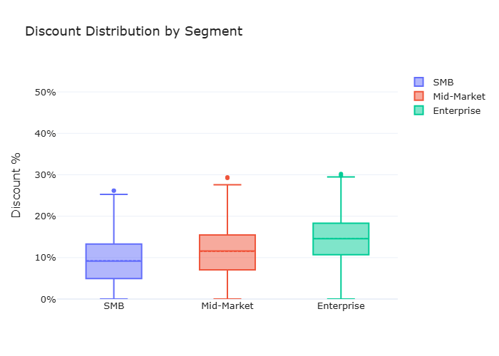
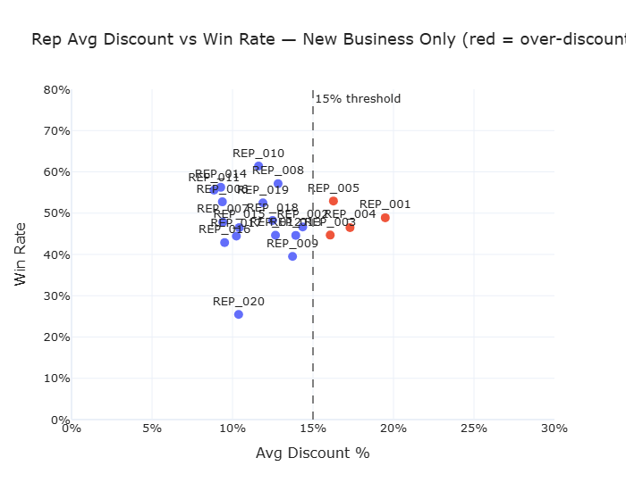
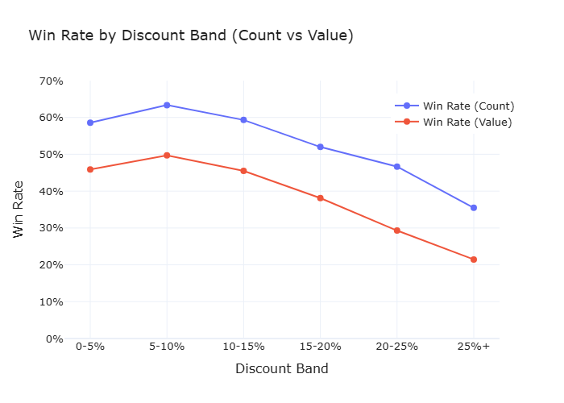
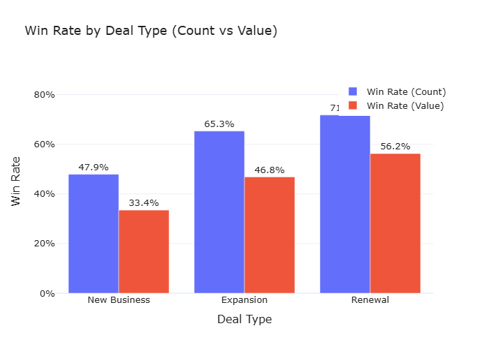
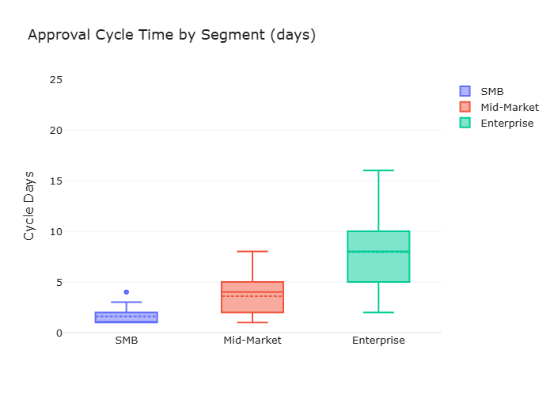
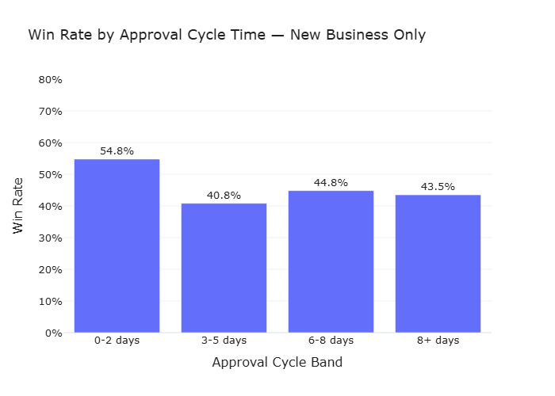
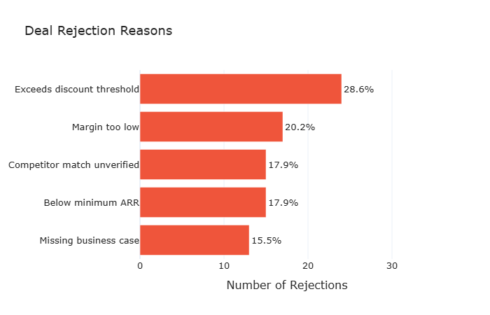
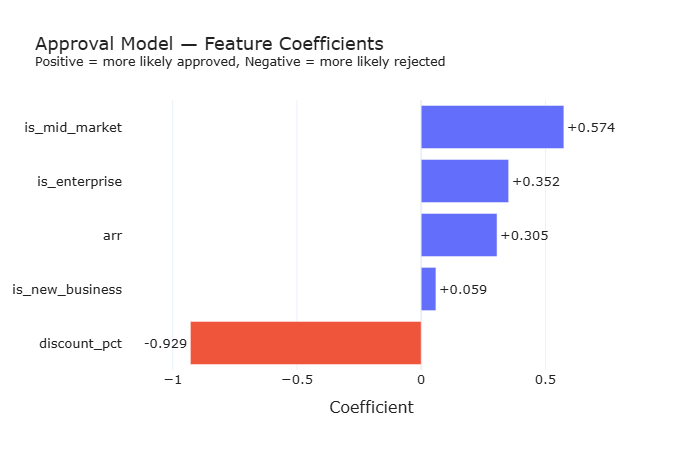
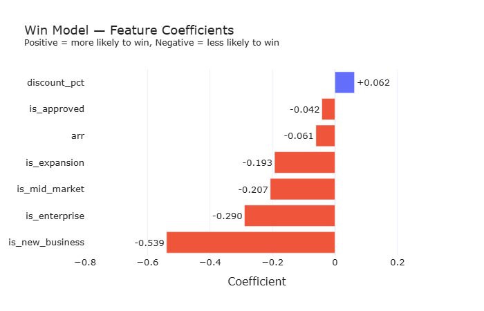
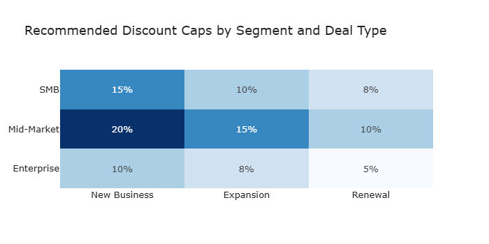

# Deal Desk Analytics
**Analysing discount elasticity, approval funnel efficiency, and deal scoring for a B2B SaaS revenue operations workflow**


---

## Portfolio Context

This is the fifth project in a RevOps analytics portfolio:

| Project | Objective | Key Technique |
|---|---|---|
| 1 · Customer Churn | Predict churn → save revenue | XGBoost, feature importance |
| 2 · Sales Pipeline | Visualise pipeline → close revenue | SQL window functions, Streamlit |
| 3 · SaaS Expansion | Predict expansion → grow revenue | Logistic regression, SHAP |
| 4 · Territory Planning | Plan territories → allocate resources | K-means, Gini coefficient |
| **5 · Deal Desk** | **Protect revenue → optimise discounting** | **Discount elasticity, deal scoring** |

---

## Business Questions

1. What is the distribution of discounts across deals and segments?
2. Which reps over-discount — and does it actually improve win rate?
3. What is the revenue impact of discounting across the portfolio?
4. How long do deals sit in approval — where are the bottlenecks?
5. What deal characteristics predict approval vs rejection?
6. What is the optimal discount threshold by segment and deal size?

---

## Key Findings

**Discounting beyond optimal thresholds does not improve win rate.**
Win rate peaks at 10-15% for SMB, 15-20% for Mid-Market, and 5-10% for Enterprise.
Enterprise reps currently average 16.1% discount on new business — well above the 10% optimal cap.

**$37.1M in discounts given portfolio-wide; 54% was on lost deals.**
Over half of all discount given generated zero revenue. Won deals averaged 10.7% discount
vs 11.8% on lost deals — reps discounted more aggressively on deals they ultimately lost.

**Slow approvals cost deals.**
New Business deals approved within 2 days win at 54.8% vs 40.8% for 3-5 days — a 14
percentage point gap. Enterprise approvals average 8 days with a P90 of 12 days.

**The current approval policy is misallocated.**
45.1% of SMB deals trigger approval despite averaging $17K ARR. Only 16.8% of Enterprise
deals go to approval despite averaging $483K ARR. The deal desk is reviewing the wrong deals.

**Recommended tiered policy reduces approval volume by 46%.**
Under the new matrix, 82.3% of deals auto-approve. CRO sees only 67 deals annually.
SMB approvals drop 72%, Mid-Market 70%, while Enterprise coverage increases 178%.

---

## Recommended Actions

| Priority | Recommendation | Impact |
|---|---|---|
| 1 | Enforce segment-specific discount caps via Salesforce CPQ | Reduce margin leakage on Enterprise new business |
| 2 | Implement approval SLAs — SMB 2d, Mid-Market 5d, Enterprise 5-10d | +14pp win rate on fast-approved New Business |
| 3 | Pre-approve expansions and renewals within discount matrix caps | Free deal desk bandwidth for New Business scrutiny |
| 4 | Tiered Enterprise approval — VP Sales 15-20%, CRO 20-25%, CRO+CFO 25%+ | Right-size approver workload, eliminate bottlenecks |
| 5 | Coach REP_009, REP_020, REP_005 on discount efficiency | Bottom 3 reps by ARR/discount ratio |
| 6 | Benchmark REP_010 best practices — 5.3x efficiency, 61.4% win rate | Replicate low-discount, high-win approach |

---

## Notebook Walkthrough

### 01 · Data Profiling
Schema validation, null checks, and distribution analysis across three tables — deals,
approvals, outcomes. Establishes baseline discount distributions, approval rates, and
win rates by segment and deal type.

### 02 · Discount Analysis
Discount depth by segment, rep, and deal type. Value-based vs count-based win rate by
discount band reveals that large deals are lost more often than small ones. Over-discounters
identified dynamically using a 15% threshold. Revenue leakage quantified at $37.1M
portfolio-wide with 54% on lost deals.






### 03 · Approval Funnel
Approval cycle time analysis by segment and approver. P90 cycle times used to set
realistic SLAs. Cycle time vs win rate analysis on New Business shows 14pp win rate
gap between fast and slow approvals. Rejection reason breakdown — 48.8% of rejections
are discount-related.





### 04 · Deal Scoring
Two logistic regression models built using sklearn Pipeline. Model 1 predicts approval
likelihood (AUC 0.746) — discount_pct is the strongest rejection driver. Model 2 predicts
win probability (AUC 0.694) — deal type and segment drive win rate more than discount.
Key insight: discount_pct has near-zero independent effect on win probability once
controlling for segment and deal type.




### 05 · Recommendations
Optimal discount thresholds derived from win rate peak analysis by segment and discount
band. Tiered approval matrix designed with realistic approver workloads — 82.3% auto-approve,
VP Sales handles bulk of exceptions, CRO sees only 67 high-risk deals. Before/after
approval volume modelling shows 46% net reduction. Executive memo for CRO.



### 06 · SQL Analysis
All key metrics reproduced in pure SQL using DuckDB — discount distribution, approval
funnel, revenue impact, rep performance, cycle time vs win rate, rejection reasons.
Confirms full analytical consistency with Python/pandas results.

---

## Real-World Notes

In production, this analysis would be extended with additional Salesforce CPQ fields:
- Contract term length and payment terms (upfront annual vs monthly)
- Ramp discounts and professional services attach
- Competitive displacement flags and strategic account designation
- Rep historical approval rate and previous deals with same account

Discount efficiency metric (Final ARR / Discount Given) assumes clean CRM data on
both won and lost deals. In practice, lost deal discount data is often incomplete —
restrict to won deals only if data quality is unreliable.

---

## Tech Stack

| Tool | Usage |
|---|---|
| Python 3.11 | Core analysis |
| DuckDB | In-memory SQL engine |
| pandas | Data wrangling |
| scikit-learn | Logistic regression, StandardScaler, Pipeline |
| Plotly | All charts |
| Faker | Synthetic data generation |
| Jupyter | Notebooks |
| Git | Version control |

---

## Domain Concepts Applied

| Concept | Definition | Used In |
|---|---|---|
| Discount Elasticity | Does discounting actually drive win rate? | Notebook 02 |
| Win Rate (Count) | Deals won / total deals | Notebooks 02-05 |
| Win Rate (Value) | ARR won / total ARR at risk | Notebook 02 |
| Effective Discount Rate | Weighted avg discount by deal size | Notebook 02 |
| Discount Efficiency | Final ARR won / total discount given | Notebook 05 |
| Approval Funnel | Deals submitted → approved → rejected → pending | Notebook 03 |
| P90 Cycle Time | 90th percentile approval time — worst-case SLA benchmark | Notebook 03 |
| Logistic Regression | Predicts binary outcome (approved/rejected, won/lost) | Notebook 04 |
| Class Imbalance | Minority class underrepresented — addressed with balanced weights | Notebook 04 |
| Tiered Approval Matrix | Discount caps with escalating approver authority by ARR and segment | Notebook 05 |

---

## How to Run

**1. Clone the repo**
```bash
git clone https://github.com/skyvisory/deal-desk-analytics.git
cd deal-desk-analytics
```

**2. Install dependencies**
```bash
pip install pandas duckdb scikit-learn plotly faker numpy jupyter shap
```

**3. Generate synthetic data**
```bash
python scripts/generate_data.py
```

**4. Run notebooks in order**
```
notebooks/01_data_profiling.ipynb
notebooks/02_discount_analysis.ipynb
notebooks/03_approval_funnel.ipynb
notebooks/04_deal_scoring.ipynb
notebooks/05_recommendations.ipynb
notebooks/06_sql_analysis.ipynb
```

---

## Project Structure
```
deal-desk-analytics/
├── data/
│   └── raw/                  # Generated by scripts/generate_data.py
├── notebooks/                # Analysis notebooks 01-06
├── outputs/                  # Chart exports (PNG)
├── scripts/
│   └── generate_data.py      # Synthetic data generation
└── README.md
```

---

*Built as part of a RevOps / data analyst portfolio. Synthetic data only — no real company information.*